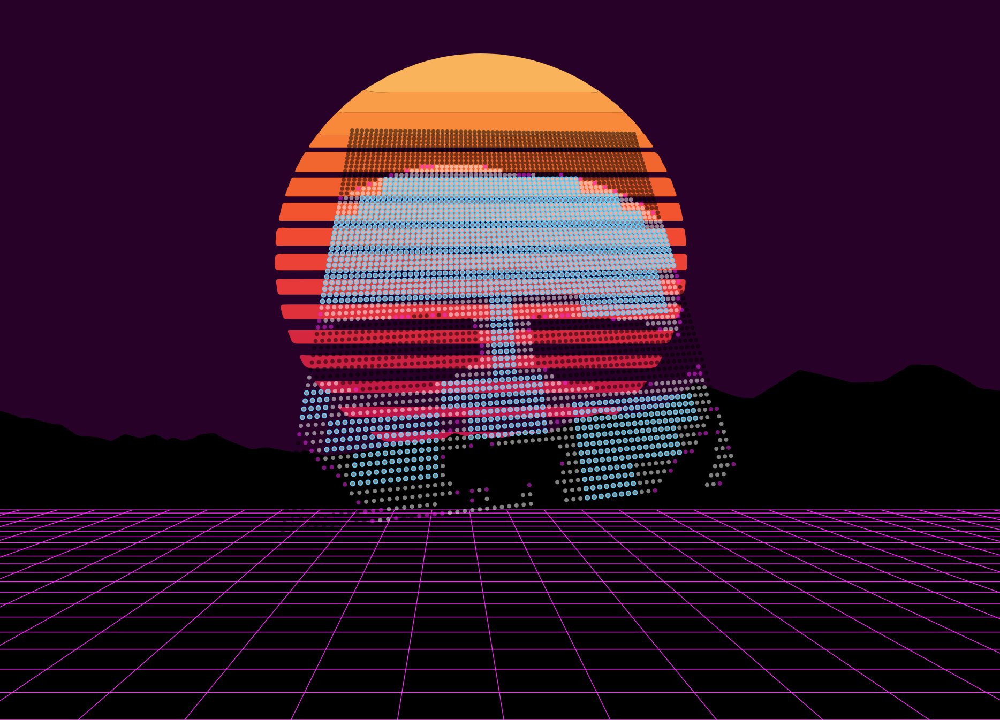

# CityScopeJS

##### also favorably known as ©® TactileScopeMatrixCityLEGOtizer ©®

CityScopeJS is a scanning component for MIT CityScope - a rapid prototyping urban modeling and simulation platform. It is made to scan a uniquely-tagged, large and continuous array of LEGO bricks with black and white tags. CityScopeJS is built with deployment, stability and ease of use in mind. CityScopeJS runs entirely in your browser, including CV, projection and spatial analysis [explored in other repos].

## Features

- web-based, HTML5 + JS without dependencies
- ~65k potential unique permutations ['brick types'] using only black and white optically tagged objects
- Dead easy setup and running in <1 min
- 100x100 4x4 LEGO grid scanning & sending to cityIO @40fps and 20x20 @20fps from Pixel 2xl Android phone

### the real important features

- Vaporware graphics
- Turing Complete
- Turing Prize Winner

## Contributions

Are more than welcome. Clone is not necessary for common usage or simple debugging but please do clone and run locally before adding `issues` or `pull requests`

---

## Using CityScopeJS

### Before starting
watch this intro video [also, 80's music] to get to know how CityScopeJS is making the world a better place:

### Running

[Click here to run CityScopeJS](https://cityscope.media.mit.edu/CS_cityscopeJS/)

- CityScopeJS should run on any modern browser with HTML5 support. Tested on Raspberry pi 2, Android and IPhone though IE7 on Windows XP might not work.

### Setup

At first run [on new computer or after `cache` or history removal in your browser] follow these instructions:

- Load `json` file using the UI file browser. JSON file should follow cityIO API V2 settings described here:
  https://github.com/CityScope/CS_CityIO_Backend/wiki
- Example for table settings are under `data` folder in a `json` format.

- NOTE: When using the above default settings, this application uses `cityIO` server backend, which lists all tables basenames. If you intend to use CityScopeJS with cityIO public server:
  - be sure to have an unique tablename, or you might overwrite someone else's table!
  - keep in mind that your local `JSON` settings file is open for all to see, so do not include sensative data beyond simple table settings. 

- upon successful loading of settings file your mouse will turn to point locator
- locate the mouse on the 4 corners of the table's scanned section
- select the top left, top right, bottom left and bottom right corners of the image (in that order)
- when done, a grid will appear, corresponding to your 4 clicks
- for fine grain correction of the grid press the keyboard `1` to `4` keys and use the arrow keys [up, down, left, right] to move the selected point
- increase or decrease the amount of pixels shifted in each keystroke using `-/_` and `=/+` keys
- check https://cityio.media.mit.edu/api or under `cityIO` UI folder to see the results

At this point, if all went well you should be able to turn the webcam and the feedback box off [using the dropdown UI], and see something like this:

## Advanced Usage

##### Editing `_YourSettings_.JSON`

- open your JSON [name it at will] file for editing
- change the `gridSize` to the size you need in `ncol`, `nrows` property
- If necessary, change the recognized patterns. To do so you'd need to edit the `codes` array in the `JSON` file.
- The codes represent white by 1 and black by 0.
- For advanced creation of binary [0,1 x 16] permutations, look into the added JSON examples
- A pattern with 4 white dots in the top-left corner and black in the rest would be `[1,1,0,0,1,1,0,0,0,0,0,0,0,0,0,0]`.

#### Clone and Run using GH desktop

- Open Github Desktop
- Click the ‘+’ icon for adding a new repository
- Under ‘Clone’, search for `cityscopeJS` and select it

#### Installation/How to test locally

- make sure `node`, `npm` and `parcel` are all installed
- navigate to the `cityscopeJS` folder on your local machine
- run using `$ parcel index.html` [`sudo` might be needed for permissions]
- parcel should build a test build on port `1234` or other

#### how to build CityScopeJS with `parcel`and deploy into GitHub pages

- navigate to the `cityscopeJS` folder on your local machine
- make an empty `gh-pages` branch and push it to GH
- Build production into `dist` folder:
- open terminal and use `GH.sh` to build the a local `dist` folder
- make changes to `.sh` to fit your static `https` and GitHub pages location

## Troubleshooting 

Note: CityScopeJS relies on a server system to send/recieve the scanned grid. This system is called cityIO. Before running CityScopeJS, make sure cityIO server is on. You can do so by visiting https://cityio.media.mit.edu. If the server is offline, leave us an issue here: https://github.com/CityScope/CS_CityIO_Backend/issues/46.

For all other issues, please follow steps above and leave an issue in this repo. 

---

## The true story behind CityScopeJS

CityScopeJS, also favorably known as _©® TactileScopeMatrixCityLEGOtizer ©®_ was invented during a warm, steamy but somehow cold summer night in December, 2013. My friend [Hackerman](https://www.youtube.com/watch?v=KEkrWRHCDQU) and I were riding [Jeremiah](https://www.youtube.com/watch?v=GBlWkNZph0s), our old faithful Trojan horse, across the Vaporwave dessert.

Since we were both holding on to Jeremiah's saddle, Hackerman was only able to write the code in 0.5 [parsecs](https://en.wikipedia.org/wiki/Parsec "Title"), using his [Nintendo PowerGlove](https://en.wikipedia.org/wiki/Power_Glove); After 6 hours of code-riding, CityScopeJS was developed, tested, QAed by NASA and SpaceX and was ready to [disrupt and make the world a better place.](https://www.youtube.com/watch?v=J-GVd_HLlps)

The system has since won the Oscars, Turing Prize, 47 pending patents, a book and was featured in nine Bollywood films.

---

using @jlouthan matrix transformations.
Maintained by [Ariel Noyman](http://arielnoyman.com)

[Repo contributors](https://github.com/CityScope/CS_cityscopeJS/graphs/contributors)
